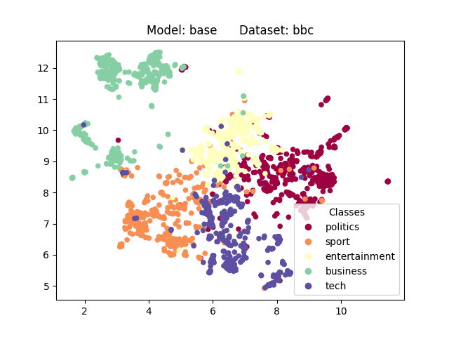
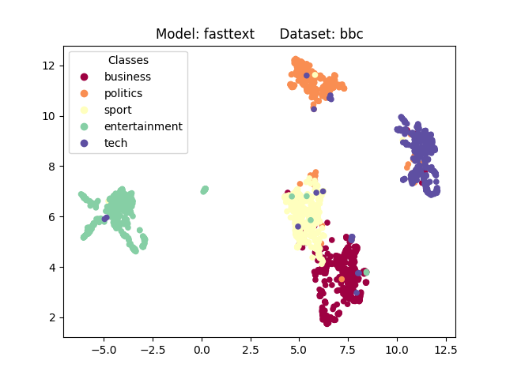

# Text-Clustering

Performing clustering on text data by using clustering algorithms from 
"DBHD: Density-based clustering for highly varying density" from Böhm et al.
Texts are transformed into embeddings by using different methods such as BERT,
Word2Vec, Fasttext and tf-idf.

Since most clustering algorithms suffer from the curse of dimensionality the
dimensionality of the embeddings is first reduced by using dimensionality
reduction techniques such as UMAP and t-SNE. The clustering is then performed
on the reduced embeddings.

Evaluation of the clustering is done as described in "Improving the Performance of 
HDBSCAN on Short Text Clustering by Using Word Embedding and UMAP" by Asyaky and Mandala.
The used datasets are labeled so NMI can be used to evaluate the clustering against
the ground truth. In addision a final evaluation is done by training an SVM classifier
that uses the base text representation and ground truth as target. This classifier is 
then compared to an SVM classifier that in addition uses the clustering result as feature.

_TextDatasetThreaded_ creates a dataset from text data or a csv file.

_TextEmbeddingsThreaded_ takes a dataset and creates text embeddings by 
using different methods.

_ClusteringAlgorithmsThreaded.py_ is used to perform the hyperparameter tuning for
all algorithms with grid search.

_optimization.py_ performs the hyperparameter tuning by using Optuna. It optimizes the clustering
algorithms as well as the dimensionality reduction algorithms.

_save_embeddings_ saves text embeddings as numpy arrays to be used for clustering
since the creaton of the embeddings is expensive.

_save_plots_ creates 2D plots of the embedded text data to be used for evaluating the 
embeddings.

_edit_csv_ creates csv files from the pickle study files that are produced by Optuna.

_evaluation_classifier.py_ evaluates the SVM classifier.

Plots of the 2D embeddings using UMAP:

  
  
  
  
  

Plots of the 2D embeddings using t-SNE:

  
  
  
  
  

