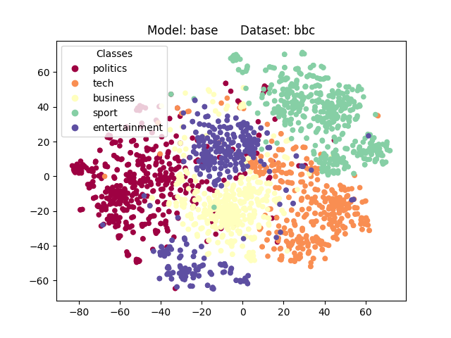
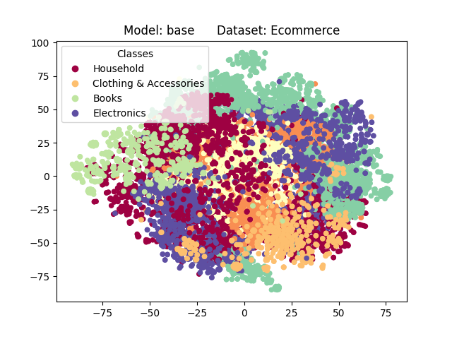
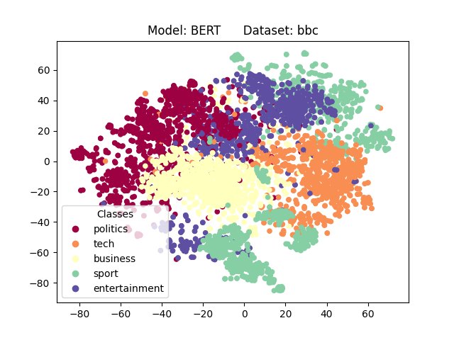
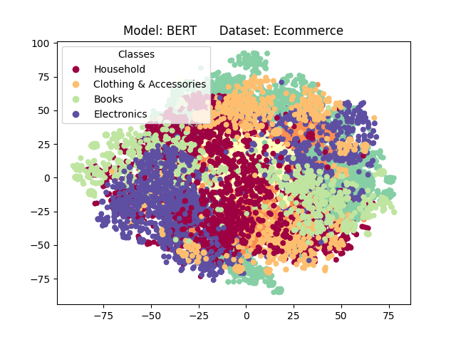
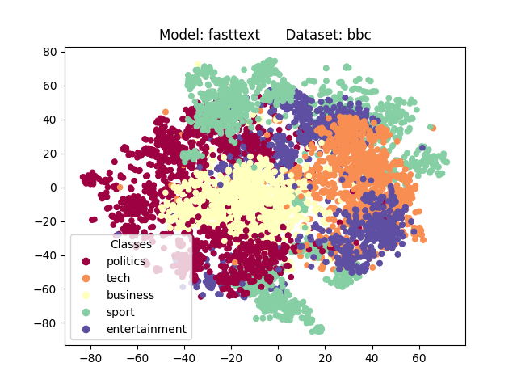
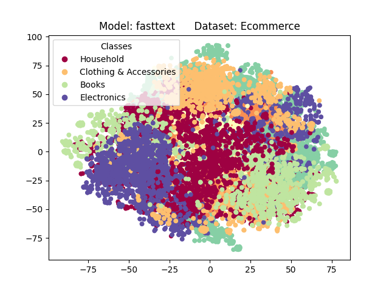
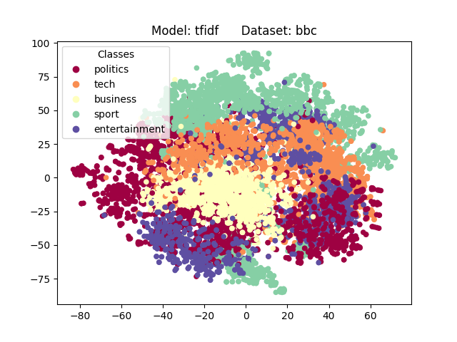
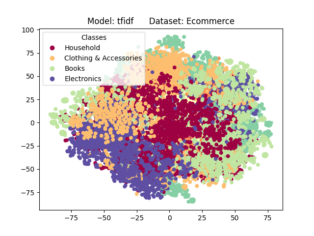
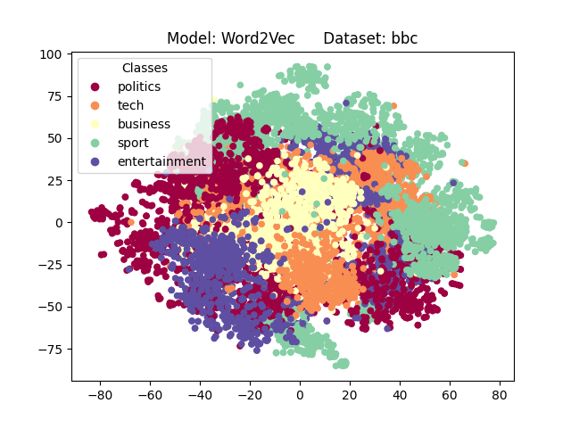
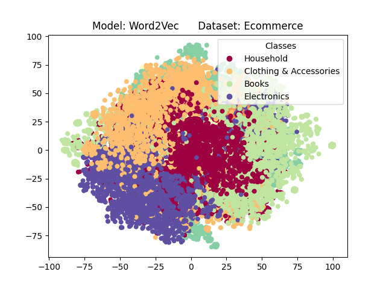

```{r setup, include=FALSE}
knitr::opts_chunk$set(echo = TRUE)
```

Datasets: bbc, Ecommerce, 20news

Number of classes: bbc 5, Ecommerce 4, 20news 20 (used only 5)

Embedding methods: BERT, tfidf, Word2Vec, fasttext

Dimensionality reduction: UMAP, t-SNE, Autoencoder

Algorithms: KMeans, DBSCAN, HDBSCAN, Meanshift, DBADV, DBHD, DPC, OPTICS, SNNDPC, SpectralClustering, SpectralACL

SVM Classifier for Evaluation


# t-SNE Plots


{width=300px height=225px}
{width=300px height=225px}
{width=300px height=225px}
{width=300px height=225px}
{width=300px height=225px}
{width=300px height=225px}
{width=300px height=225px}
{width=300px height=225px}
{width=300px height=225px}
{width=300px height=225px}


# Autoencoder Plots

{width=300px height=225px}
{width=300px height=225px}
{width=300px height=225px}
{width=300px height=225px}
{width=300px height=225px}
{width=300px height=225px}
{width=300px height=225px}
{width=300px height=225px}
{width=300px height=225px}
{width=300px height=225px}

```{r, echo=FALSE, message=FALSE, warning=FALSE}
library(dplyr)
library(knitr)

dbscan = readr::read_csv('../Studies/bbc/tsne/csvs/DBSCAN_data.csv')
kmeans = readr::read_csv('../Studies/bbc/tsne/csvs/KMeans_data.csv')
#SpectralClustering = readr::read_csv('../Studies/bbc/tsne/csvs/SpectralClustering_data.csv')
optics = readr::read_csv('../Studies/bbc/tsne/csvs//OPTICS_data.csv')
dbhd = readr::read_csv('../Studies/bbc/tsne/csvs//DBHD_data.csv')
meanshift = readr::read_csv('../Studies/bbc/tsne/csvs//MeanShift_data.csv')
snndpc = readr::read_csv('../Studies/bbc/tsne/csvs/SNNDPC_data.csv')
hdbscan = readr::read_csv('../Studies/bbc/tsne/csvs/HDBSCAN_data.csv')
SpectralACL = readr::read_csv('../Studies/bbc/tsne/csvs/SpectralACL_data.csv')
dbadv = readr::read_csv('../Studies/bbc/tsne/csvs/DBADV_data.csv')
dpc = readr::read_csv('../Studies/bbc/tsne/csvs/DPC_data.csv')
#lsdbc = readr::read_csv('LSDBC.csv')
```

# Clustering of bbc dataset with t-SNE

DBSCAN
```{r, echo=FALSE}
dbscan %>%
  group_by(embedding) %>%
  arrange(desc(NMI)) %>% 
  slice_head(n = 3) %>%
  ungroup %>%
  mutate(across(where(is.numeric), ~ round(., 3))) %>%
  kable

```

KMeans
```{r, echo=FALSE}
kmeans %>%
  group_by(embedding) %>%
  arrange(desc(NMI)) %>% 
  slice_head(n = 3) %>%
  ungroup %>%
  mutate(across(where(is.numeric), ~ round(., 3))) %>%
  kable

```


OPTICS
```{r, echo=FALSE}
optics %>%
  group_by(embedding) %>%
  arrange(desc(NMI)) %>% 
  slice_head(n = 3) %>%
  ungroup %>%
  mutate(across(where(is.numeric), ~ round(., 3))) %>%
  kable

```

DBHD
```{r, echo=FALSE}
dbhd %>%
  group_by(embedding) %>%
  arrange(desc(NMI)) %>% 
  slice_head(n = 3) %>%
  ungroup %>%
  mutate(across(where(is.numeric), ~ round(., 3))) %>%
  kable

```

Meanshift
```{r, echo=FALSE}
meanshift %>%
  group_by(embedding) %>%
  arrange(desc(NMI)) %>% 
  slice_head(n = 3) %>%
  ungroup %>%
  mutate(across(where(is.numeric), ~ round(., 3))) %>%
  kable

```

SNN-DPC
```{r, echo=FALSE}
snndpc %>%
  group_by(embedding) %>%
  arrange(desc(NMI)) %>% 
  slice_head(n = 3) %>%
  ungroup %>%
  mutate(across(where(is.numeric), ~ round(., 3))) %>%
  kable

```

HDBSCAN
```{r, echo=FALSE}
hdbscan %>%
  group_by(embedding) %>%
  arrange(desc(NMI)) %>% 
  slice_head(n = 3) %>%
  ungroup %>%
  mutate(across(where(is.numeric), ~ round(., 3))) %>%
  kable

```

SpectralACL
```{r, echo=FALSE}
SpectralACL %>%
  group_by(embedding) %>%
  arrange(desc(NMI)) %>% 
  slice_head(n = 3) %>%
  ungroup %>%
  mutate(across(where(is.numeric), ~ round(., 3))) %>%
  kable

```

DBADV
```{r, echo=FALSE}
dbadv %>%
  group_by(embedding) %>%
  arrange(desc(NMI)) %>% 
  slice_head(n = 3) %>%
  ungroup %>%
  mutate(across(where(is.numeric), ~ round(., 3))) %>%
  kable

```

DPC
```{r, echo=FALSE}
dpc %>%
  group_by(embedding) %>%
  arrange(desc(NMI)) %>% 
  slice_head(n = 3) %>%
  ungroup %>%
  mutate(across(where(is.numeric), ~ round(., 3))) %>%
  kable

```