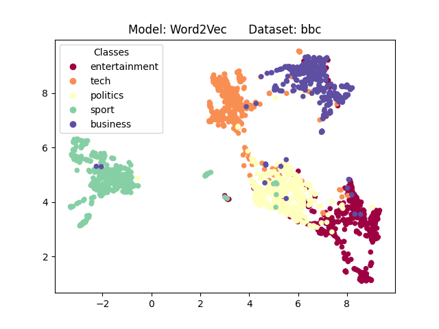
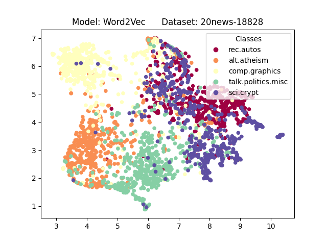
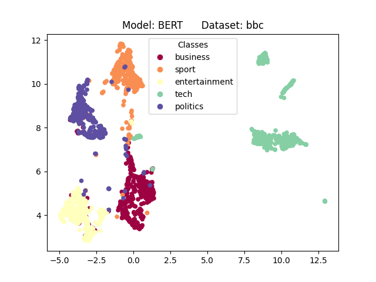
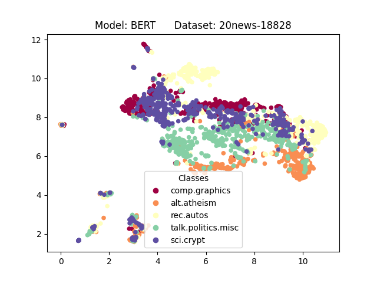
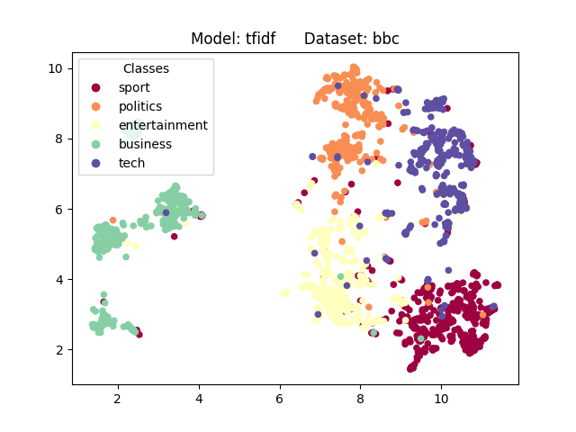
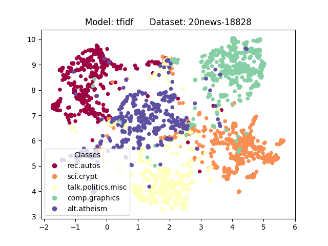

```{r setup, include=FALSE}
knitr::opts_chunk$set(echo = TRUE)
```

```{r, echo=FALSE, message=FALSE, warning=FALSE}
library(stringr)
library(knitr)
library(dplyr)
df = read.csv('embeddings/umap_results.csv')

split_col <- str_split(df$dataset, "_", simplify = TRUE)

# Create new columns with the split values and rename them
df$dataset <- split_col[, 1]
df$col2 <- split_col[, 2]
df$col3 <- split_col[, 3]

# Rename the columns as desired
colnames(df)[which(names(df) == "col1")] <- "dataset"
colnames(df)[which(names(df) == "col2")] <- "model"
colnames(df)[which(names(df) == "col3")] <- "max_files_per_class"
df$NMI <- round(df$NMI, digits=3)
df$Purity <- round(df$Purity, digits=3)
df[, c("dataset", "model", "max_files_per_class", "dimensions", "NMI", "Purity")] %>% kable
```
{width=300px height=225px}
{width=300px height=225px}
{width=300px height=225px}
{width=300px height=225px}
{width=300px height=225px}
{width=300px height=225px}


